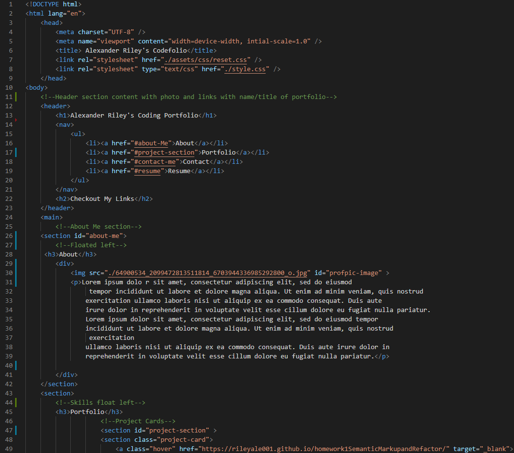
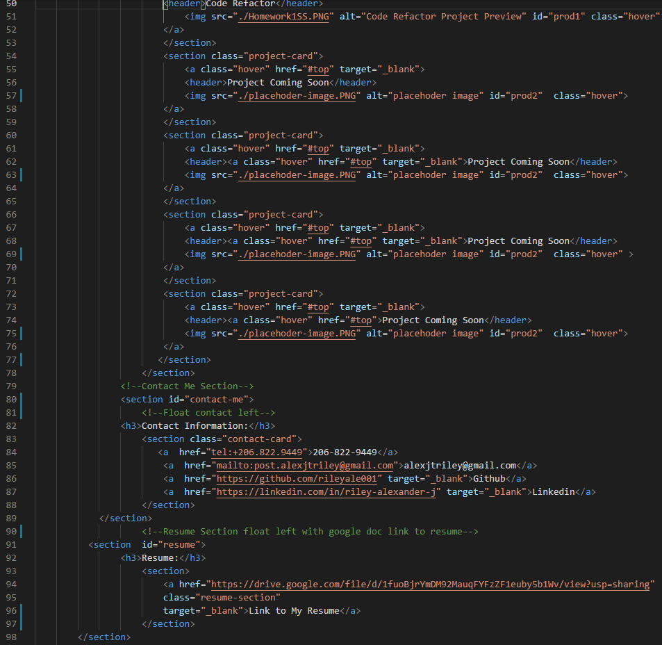
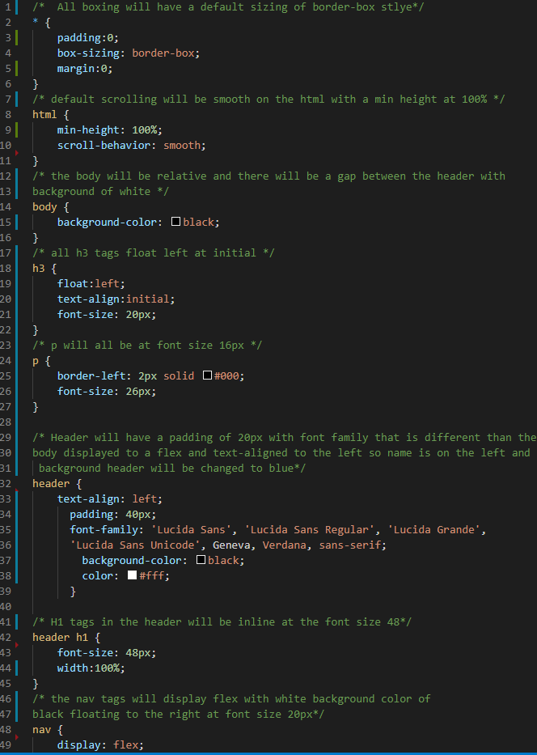
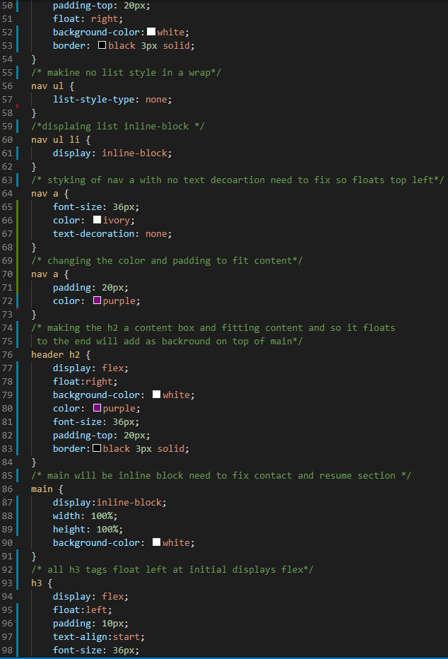
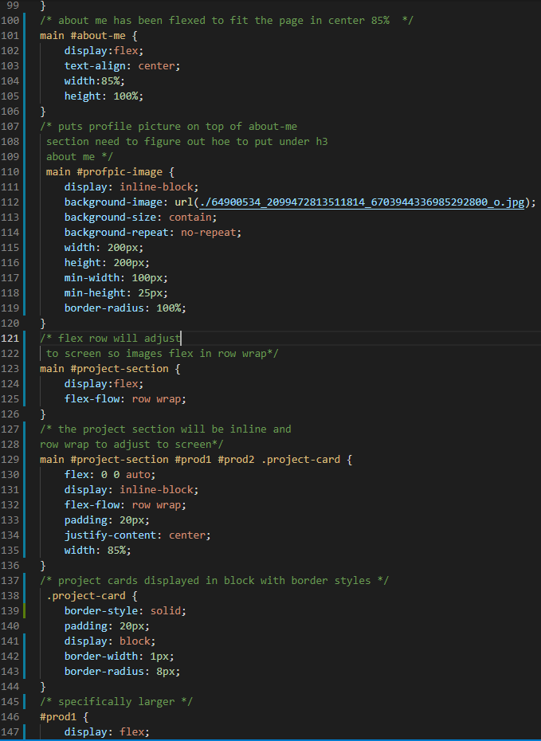
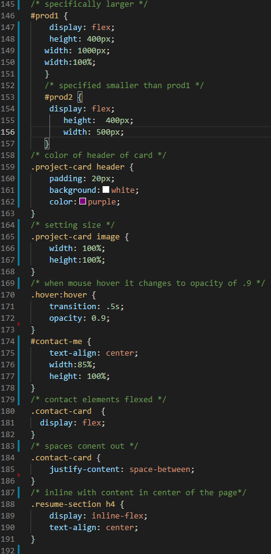
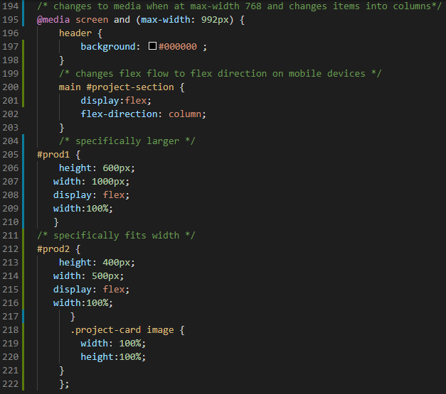
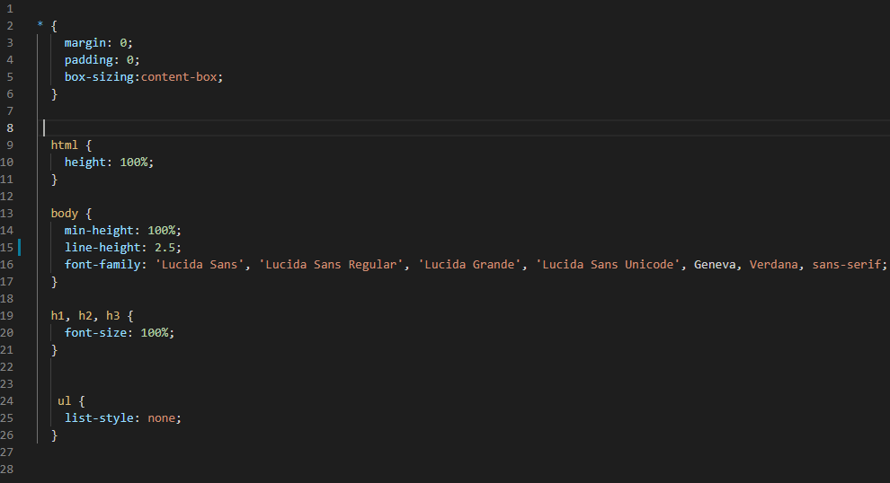

# 02 Advanced CSS: Portfolio 2

## Task

Create a web application from scratch!
Build a portfolio page!
For this project I am creating a portfolio to showcase my skills and talents to show future employers looking to hire a web developer. I have tried to create an effective portfolio to highlight my strongest works in this coding bootcamp. I hope to work on this portfolio throughout this course as I know it took me a week after to submit it is still a work in progress. This portfolio showcases my skills learned so far in flexbox, media queries, and css variables. Let’s take a look at what I have done so far.

## HTML

The following was executed in the html:

- followed a semantic markup layout for the html file structure. Class/ID naming conventions were followed
- The link to the html loads with  no errors for the links other than the temporary placeholder links that returns the user to the top of the document.
- When the initially loaded the html shows my name, a recent phot, links to about, portfolio, and contact and resume sections.
- When the user clicks the links in the nav it scrolls the user to the designated reference on the site.
- When the user looks at the portfolio section they will see a larger image for the first project on any device view.
- When you click on the first portfolio project the user is taken to the application with no error.
- When the user resizes the screen the content is adjusted to fit that device.
- The html is slightly referenced to the example layout provided I need to make adjustments later.
- added a reset css and css link so that the html would have a style that adapts to users screens
- The html has commenting specifically to the different sections.

## CSS

The following was executed in the css:

- The viewport adjust to the users device.
- The css follows a semantic markup that matches the html.
- The layout matches the provided example slightly.
- The css has descriptive commenting.
- The css contains the media query.

## CSS Reset

## Links

[Github](https://github.com/rileyale001/alexanderrileyportfolio1)

[Website link](https://rileyale001.github.io/alexanderrileyportfolio1/)